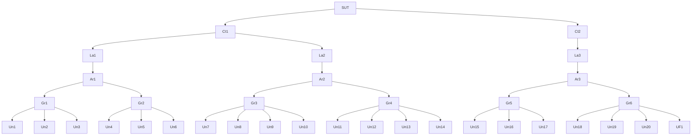
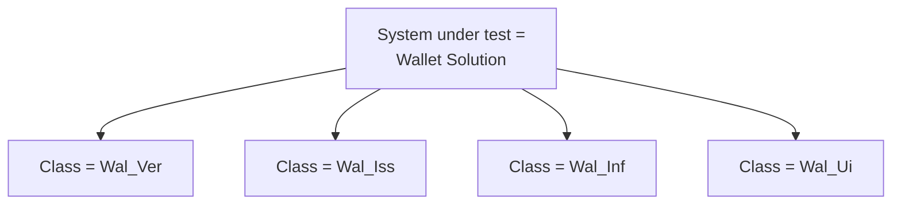

# FCAF Overview

Within the EUDI Wallet ecosystem, functional conformance testing spans multiple process flows, including issuance, revocation, and presentation. Where individual flows allow multiple implementation options, testing may need to address different specifications and technical variants.

To manage this diversity in a structured and scalable way, the FCAF defines a **hierarchical test structure** that supports consistency, traceability, and incremental evolution.

The hierarchy is defined as follows:

- **SUT** – System Under Test  
- **Cl** – Test Class  
- **La** – Test Layer  
- **Ar** – Test Area  
- **Gr** – Test Group  
- **Un** – Test Unit  
- **UF** – Test Unit Fraction  

*Figure 1: Test case hierarchy*

The test hierarchy is not static. While the upper levels (SUT, class, and layer) are expected to remain relatively stable, lower levels—particularly areas and groups—are expected to evolve iteratively over time to maintain balanced and manageable test coverage.

## Approach

The following diagram illustrates the proposed approach to creating the test suites that will form a key part of the FCAF:

*Figure 2: Overview of FCAF Approach*

The development of the Test Suites (set of Test Cases) will be done in the following phases:
- **Test Structure** - designing the overall structure of the Test Suites by examining the core international standards and specifications on which EUDI wallet solutions rely.
- **Test Objectives** – following the Test Structure to step through the individual standards and technical specifications line by line, to identify text that is testable and defining Test Objectives (i.e. a statement of what is to be tested). This phases will also include applying the profiles, as defined by ETSI and relevant EC Technical Standards, to refine the Test Objectives. This could include:
  - Removing Test Objectives that are not in scope for EUDI wallets.
  - Making Test Objectives more specific where required by ETSI or the EC Technical Standards.
  - Removing duplicate Test Objectives where an item is covered in multiple places.
- **Test Cases** – where the Test Objectives are turned in detailed Test Cases that define amongst other things test conditions, test steps and success criteria.

Each phase refines and narrows the scope of testing, with the goal of ensuring that Test Case writing phase (the phase requiring the most effort) is as efficient as possible.

## Systems Under Test

Within the broader EUDI Wallet ecosystem, several systems may be subject to functional conformance testing, including:

- Wallet Solutions (WS)
- Issuers (PID/Attestation Providers)
- Verifiers (Relying Parties)
- Trust Infrastructure Components

For the test structure defined by the FCAF, **the designated System Under Test (SUT) in the initial phase is the Wallet Solution**.

Additional SUTs may be incorporated in future iterations of the framework.

## Test Structure

### Test Classes

The scope of functional conformance testing for a Wallet Solution
covers both:

- **External interfaces**, including interactions with Issuers Verifiers, and Infrastructure Components. Conformance testing should
demonstrate compliance with applicable specifications and standards as applied within the EUDI Wallet ecosystem.
- **Internal functionality**, where functional requirements are defined by regulations, implementing acts, or referenced technical standards, but cannot be fully tested via a standardised external interface.

A **Test Class** groups all functionality associated with a specific interface or peer interaction.

For the Wallet Solution as SUT, the following Test Classes are defined:

- **Wallet_Ver (Wal_Ver)** – Interface between the Wallet Solution and Verifiers, covering proximity and remote presentation and related functionality.
- **Wallet_Issuer (Wal_Iss)** – Interface between the Wallet Solution and Issuers, covering issuance, provisioning, and related functionality.
- **Wallet_Infrastructure (Wal_Inf)** – Interface between the Wallet Solution and Infrastructure Components.
- **Wallet_UI (Wal_Ui)** – User-facing wallet functionality that cannot be fully tested via standardised external interfaces.

The first three classes cover external interfaces. The **Wallet_UI** class primarily addresses internal functionality exposed to the user in an implementation-specific manner.

*Figure 3: Systems under test and test classes*

For other potential SUTs, equivalent Test Class groupings are expected, for example:

- **Issuers (Iss)**
    - Issuer_Wallet (Iss_Wal)
    - Issuer_RP (Iss_Ver)
    - Issuer_Infrastructure (Iss_Inf)
- **Verifiers (Ver)**
    - Ver_Wallet (Ver_Wal)
    - Ver_Issuer (Ver_Iss)
    - Ver_Infrastructure (Ver_Inf)

### Test Layers

Each Test Layer is subdivided into **Test Areas**, which may be further divided into **Test groups** and **Test Units**. This structure supports systematic organisation of test cases while allowing flexibility as coverage evolves.

To be as comprehensive as possible the following 6 test layers are defined:

- DM - Data Model
- MS - Message Structure
- IA - Interaction
- SM - Security Mechanisms
- UC - Use Cases
- SH - Shared
- O – Others

Each layer comprises various Test Areas, that vary per Test Layer. Similarly, Test Areas can be devided in Test Groups, and Test Groups in Test Units. Their goal is to organize the different tests.

## Test Cases
Each test case is defined by the following information

| Term | Description  |
| --- | --- |
| Test case-ID | Uniquely identifies the test case. |
| Test Objective | Specifies the requirement(s) addressed in this test case |
| References | Identifies specific references to the requirement(s) addressed by this test case. |
| Profile | Defines the profile(s) for which the test case is applicable. |
| Preconditions | Define the state in which the IUT (implementation under test) needs to be before the test case can be executed. |
| Test scenario | Defines the test steps that shall be taken. Each step covers a simple, exactly defined operation with a measurable result that can be included in the test report. The steps shall be performed in the order listed. Each test step is defined by the following information: <ul><li>Test step ID: a consecutive number, uniquely identifying each test step and the execution order in the test case.</li><li>Description: defining the operation that has to be executed for this step.</li><li>Configuration data: optionally specifying input data required to perform this test step.</li>
| Expected result | The expected result defines pass criteria for each test step in the test scenario. The analysis of the observed result in comparison with the expected result leads to a verdict, e.g. "Pass" or "Fail". The results of the individual test steps or the overall result, or both, of the test case are transferred to the test report. |

### Test Case ID

Test cases are grouped by SUT and Test Class (interface tested). 

Test case IDs are formed as follows:

    SUT_TestClass_TestLayer_TestArea_TestGroup_TestUnit_*nnn*

Where *nnn* is a three-digit decimal number identifying the test case.

In case one of the subdivisions is not present the name is omitted.

### EUDI-wallet Relevancy

The EUDI Wallet ecosystem uses numerous standards and technical specifications. Many of these have a broader application than EUDI Wallets, while others are specific to EUDI Wallets. Furthermore the standards and technical specifications influence each other, for example by referencing, profiling and extending each other.

During establishing the FCAF, tests have to be considered per individual standard and technical specification. As a result Test Objectives or Test Ccases can be identified for requirements that are not relevant to EUDI Wallets. Others will be explicitly and specifically applicable to EUDI Wallets.

To accomodate selecting, tracking and managing these together with Standards Developing Organisations (SDOs), CABs and others, a "EUDI Wallet relevancy" is included in the Test Case template in the FCAF. 

This effectively has two labels, as follows:

- A first label for the origin of a requirement.

One of the following values shall be used for this label:

| label | meaning
| --- | ---
| EUDI_agnostic | Requirement is defined for general purpose use, and is not relevant to EUDI Wallets.
| EUDI_generic | Requirement is defined for general purpose use, and is relevant to EUDI Wallets.
| EUDI_specific | Requirement is specifically defined for EUDI Wallets.

- A second label to select scope of a Test Objective/Case.

| label | meaning
| --- | ---
| EUDI_required | Requirement is applicable to EUDI Wallets.
| EUDI_optional | Requirement is optional for EUDI Wallets.
| EUDI_forbidden | Requirement is explicitly excluded or prohibited for usage with EUDI Wallets.
| EUDI_undefined | Applicability of requirement is up to discretion of wallet /assessor. 

Both labels are applicable; some combinations will be mutually exclusive (e.g. agnostic x required, or specific x forbidden).

### Profile

Profiles identify which set of functionalities are in scope for the configuration adopted in the implementation under test (IUT). If a profile is present in a Test Case, this impacts the applicability of that Test Case. 

The Test Case selection is based upon comparing the profile of the Test Case to the IUT information in the ICS filled out by the applicant or tester. 
- If no profile is listed in a Test Case: The Test Case shall be executed on all IUT.
- If one or more profiles are specified and the IUT does not match with all of the specified profiles: the Test Case shall be skipped for that IUT and shall be marked as Not Applicable in the test report.
