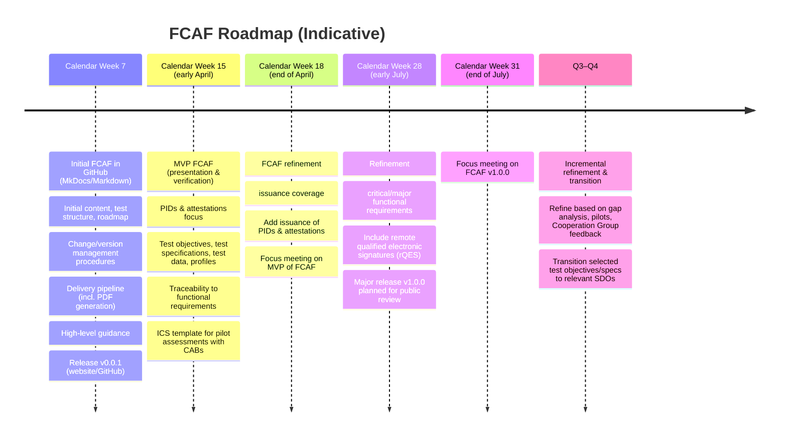

# Introduction

The European Commission adopted [Commission Implementing Regulation (CIR) (EU) 2024/2981](https://eur-lex.europa.eu/legal-content/EN/TXT/HTML/?uri=OJ:L_202402981) on the certification of European Digital Identity (EUDI) Wallets.
This Regulation establishes the **baseline framework for certification**, including requirements related to cybersecurity, privacy, and operational assurance.
It also requires conformity assessment of **functional requirements** defined by the following CIRs (see [Annex III of CIR (EU) 2024/2981](https://eur-lex.europa.eu/legal-content/EN/TXT/HTML/?uri=OJ:L_202402981#anx_III)):

- **Integrity and core functionalities** — CIR (EU) 2024/2979
- **Protocols and interfaces** — CIR (EU) 2024/2982
- **Person identification data and electronic attestations of attributes** — CIR (EU) 2024/2977

To harmonise the functional conformity assessment required during certification, the European Commission is establishing a **Functional Conformance Assessment Framework (FCAF)** for the following reasons:

- Preventing market fragmentation
- Ensuring a uniform high level of robustness and security
- Reducing certification costs and duplication
- Strengthening EU-wide cyber-resilience
- Enabling coherent and comparable conformance testing
- Increasing transparency and auditability
- Facilitating interoperability across implementations and Member States

The FCAF provides a **shared**, **transparent**, and **reusable set of test suites** that can be applied conistenly by **Conformity Assessment Bodies (CABs)**, test tool vendors, wallet providers, test laboratories, tool vendors and other stakeholders.

The FCAF aims to:

- Provide a common set of test suites, test specifications, data definitions, and profiles enabling CABs and test laboratories to evaluate functional and functional-security requirements,
- define structured test specifications (e.g., preconditions, steps, expected results) that are tool-agnostic and may be executed manually or via externally developed tooling,
- build upon a gap analysis of existing test specifications for essential standards and technical specifications relevant to EUDI Wallet solutions (see [Focus X document](https://ec.europa.eu/digital-building-blocks/wikis/spaces/CG/pages/767071732/Topic+X+-+Conformance+testing+for+functional+requirements),
- draw methodological inspiration from ISO/IEC 18013-6,
- be developed in collaboration with Standards Development Organisations (SDOs),
- be governed by the European Commission, in cooperation with Member States through the EUDI Wallet Cooperation Group.

## Background

This work relates to functional conformance testing under the EUDI Wallet certification framework as established by **CIR (EU) 2024/2981**.

The objective is to test:

- Combinations of technical provisions from CIRs and referenced standards that together constitute the **functional requirements** EUDI Wallets are expected to support,
- **production-like use** of these technical provisions, including all relevant functional security requirements, and
- only those functional requirements from standards that are **actually used by EUDI Wallets**.

Earlier work on the FCAF resulted in the publication of the **Focus X** document, which covered the following activities:

- An assessment of existing standards, test specifications, and tools relevant for functional conformance testing,
- a summary of identified gaps, and
- an outlook on actions required to achieve comprehensive test coverage and interoperability between Wallet Solutions.

The Focus X document concluded that significant gaps exist in current test specifications for functional requirements
defined in relevant CIRs and referenced standards. To support harmonised evaluation of functional requirements during
the certification of EUDI Wallet solutions, a **common and structured testing methodology** is required.
The FCAF aims to address this need.

## Functional conformance testing

Functional conformance testing aims to demonstrate that an implementation behaves as required by applicable standards,
technical specifications, profiles, and regulatory requirements, and that it can interoperate within the EUDI Wallet ecosystem.

### Conceptual coverage

Functional conformance testing typically includes:

- **External interface testing**: behaviour observable at standardised interfaces
  (e.g., Wallet Solution ↔ PID/Attestation Provider, Wallet Solution ↔ Verifier).
- **Internal functional requirements**: behaviour mandated by regulations or technical standards that may not be fully
  testable via standardised external interfaces, and therefore may require structured manual testing or inspection
  of observed behaviour, e.g., wallet asks the user to provide consent before sharing data with a Verifier.

### Rationale

Functional conformance testing is necessary:

- Because it is not feasible to test all permutations in a many-to-many ecosystem
  (Wallets × PID/Attestation Providers × Verifiers),
- to enable seamless and consistent operation of the ecosystem, which is essential for adoption and long-term success, and
- to achieve interoperability across implementations and Member States.

### Distinction from other testing

Functional conformance testing is distinct from:

- **Sandbox or “happy-flow” interoperability testing**, which is primarily useful during development or test events,
- **non-functional testing**, such as performance, scalability, penetration testing, or availability testing, and
- **operational readiness testing**, including release management, monitoring, and incident response.

The FCAF focuses on providing **repeatable and comparable functional test suites**.

## Scope

The FCAF supports testing of **functional and functional-security requirements relevant within the EUDI Wallet ecosystem** by
providing test objectives and test specifications for:

- Wallet **external interfaces** with PID/Attestation Providers, Verifiers, and Infrastructure Components, and
- wallet **internal functionality** where functional requirements exist but cannot be validated solely through an
  external interface.

The FCAF is composed of the following core artefacts:

- **Test specifications**: structured definitions of primarily automatable tests, including inputs, steps, and expected results.
- **Test books**: structured collections of manual or non-automatable test cases (e.g. user-facing flows).
- **Data definitions**: logical and/or physical definitions of test data required for repeatable and comparable assessments.
- **Traceability mappings**: mappings between test cases and functional requirements defined in CIRs and relevant
  standards or technical specifications.
- **Application guidance**: guidance for CABs on how to apply the artefacts consistently and how to report outcomes, i.e., Implemenation Conformance Statement (ICS).
- **Catalogue of externally developed testing tools**: a curated and non-exhaustive overview of third-party tools that may support execution or automation of FCAF test specifications, without the FCAF itself providing or mandating specific testing tooling.

Functional conformance testing is one component of national EUDI Wallet certification schemes established by Member States.
The FCAF defines test suites addressing **functional requirements** as required by the regulation.
Additional certification components, as defined in **CIR (EU) 2024/2981**, must be considered to achieve full certification.

## Out of scope

The FCAF addresses functional conformance testing only.
It therefore excludes aspects of EUDI Wallet certification and evaluation that are not expressed as functional or functional-security requirements testable through functional conformance artefacts.

The FCAF does **not** cover certification activities related to:

- **Cybersecurity assurance**, including resistance to attacks, vulnerability management, secure development practices, and other security evaluation activities defined outside functional conformity.
- **Procedural or operational assurance**, such as organisational controls, lifecycle governance, incident handling, monitoring, and certification-scheme-specific operational processes.
- **Privacy and data-protection assurance**, except where privacy requirements are explicitly formulated as functional or functional-security requirements that can be evaluated through functional conformance testing.

These aspects are addressed through **separate assurance and certification processes** defined in applicable legislation and certification schemes.

The FCAF does **not** include:

- **Non-functional testing**, such as performance, scalability, availability, or penetration testing.
- **Operational or production-readiness assessments**, including deployment validation, monitoring capability, or service-management preparedness.

The FCAF defines test specifications, supporting artefacts, and application guidance, but it does **not**:

- provide, mandate, or maintain testing tools or execution environments, or
- prescribe specific automation frameworks for running the defined tests.

Execution tooling may be developed externally and used by CABs, test laboratories, or other implementers.

## Roadmap (Indicative)

> ⚠️ This roadmap is indicative and subject to change.

The roadmap provides a **high-level orientation only** and should not be interpreted as a binding delivery plan.

