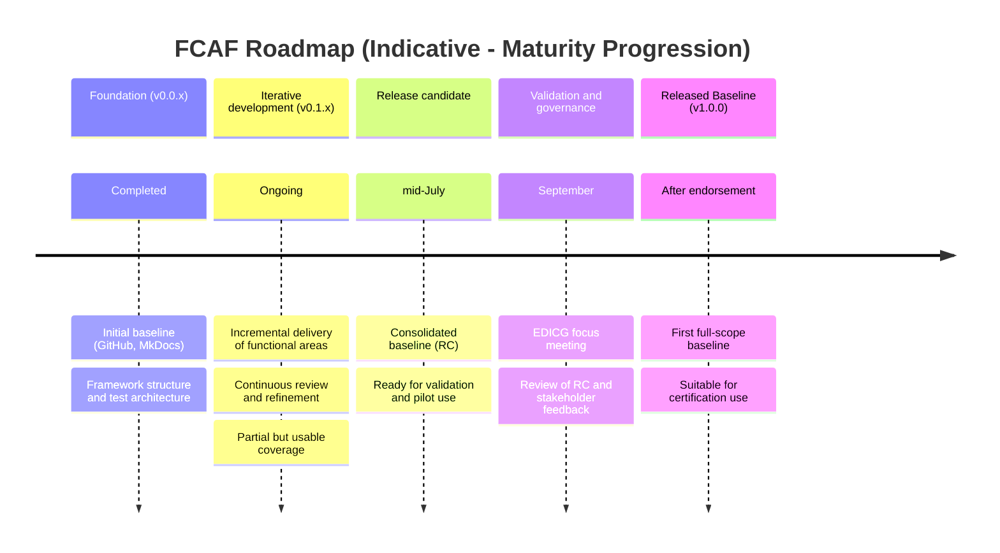

# Roadmap (Indicative)

> ⚠️ This roadmap is indicative and subject to change.

The roadmap provides a **high-level orientation only** and should not be interpreted as a binding delivery plan.

From version **v0.1.0 onwards**, the FCAF follows an **iterative delivery model**:

- Framework content and test cases are published early as **draft baseline content**
- Content is refined incrementally through:
  - structured review,
  - issue tracking, and
  - pull requests

The **v0.x.y series represents continuous iteration**, not discrete feature-complete releases.
Maturity is reflected through staged progression (reviewed → release candidate → released baseline) and corresponding versioned releases.

While individual releases in the **v0.x.y series** provide usable and implementation-ready subsets of functionality, they represent **partial coverage** of the overall framework.

These releases are intended to support implementation, testing, and early validation. The **v1.0.0 release** will represent the first full-scope, sufficiently consolidated baseline suitable for certification.

Iterations of the core team are organised around the key functional areas outlined in the scope overview above.

Work progresses iteratively across these areas, with a **primary focus typically applied in the following order**:

- **Presentation flows** (e.g. OID4VP, HAIP, ISO/IEC 18013-5/-7, ETSI profiles)
- **Issuance flows** (e.g. OID4VCI, HAIP, ETSI profiles)
- **Credential formats** (e.g. SD-JWT VC, ISO mdoc, ETSI profiles)
- **Trust and integrity mechanisms** (e.g. WUA/WIA, trust lists, verifier certificates, ETSI alignment)
- **Qualified signatures and advanced use cases** (e.g. rQES, ETSI alignment)

These areas are **not addressed strictly sequentially**. Instead:

- multiple areas are developed in parallel,
- progress varies depending on complexity and dependencies, and
- feedback from implementation and review continuously influences prioritisation.

In particular:

- **Data models** (e.g. PID, EEA) are developed in parallel with presentation and issuance flows, and
- **Regulatory alignment** (e.g. Implementing Acts) is progressively integrated as part of later consolidation stages.

The scope overview reflects the **current status of coverage and progress** across these areas and should be read as a snapshot of ongoing work rather than a strictly sequential plan.

This progression supports incremental consolidation across specifications, profiles, and regulatory layers.

